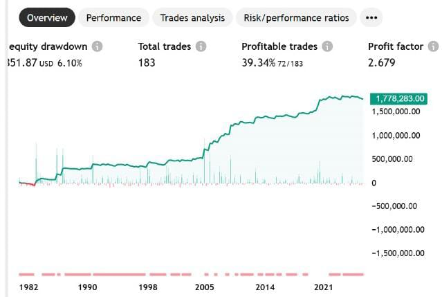

# EMA Crossover Strategy Backtest

This project implements a simple yet effective *Exponential Moving Average (EMA) Crossover Strategy* for trading Apple Inc. (AAPL) stock. The strategy uses two EMAs (10 and 30 periods) to generate buy and sell signals, aiming to capture medium-term trends and improve overall trading profitability.

---

## Project Purpose

The goal of this strategy is to:

- Demonstrate the use of Pine Script for creating and backtesting trading strategies on TradingView.
- Explore how EMA crossovers can identify entry and exit points.
- Analyze the historical performance of the strategy on Apple Inc. stock data.
- Provide insights on profitability, risk, and drawdown through detailed backtest results.
- Build a sharable, documented portfolio piece for GitHub, Upwork, and LinkedIn profiles.

## Backtest Overview

Key Metrics:

- *Equity Drawdown:* 84,851.87 (6.10
- *Total Trades:* 183
- *Profitable Trades:* 72 (39.34
- *Profit Factor:* 2.679
- *Net Profit:*1,778,283.02 USD
- *Max Equity Run-Up:* $1,941,478.87 (67.22%)

---

## Performance Summary

## Detailed Performance:

- *Open P   L:* +24,855.18 (+0.89%)
- *Gross Profit:* 2,837,396.33 USD (283.74
- *Gross Loss:*1,059,113.31 USD (105.91%)
- *Buy & Hold Return:* +1,982,083,254.05 USD (198,208.33
- *Max Equity Drawdown:*84,851.87 USD (6.10%)
- *Average Winning Trade:* 39,408.28 USD (23.60
- *Average Losing Trade:*10,698.11 USD (6.31%)
- *Ratio Avg Win / Avg Loss:* 3.684

---
 ## How This Helped

This EMA Crossover Strategy addresses a common trading challenge:

"*How can a trader systematically identify trend reversals and enter trades with less emotional bias?"*

By automating entry and exit rules using EMA crossovers, this strategy:

- *Reduces emotional trading decisions* by following fixed logic.
- *Helps capture medium-term trends* using momentum-based signals.
- *Improves timing of entries and exits*, avoiding late reactions to market moves.
- *Allows for historical performance testing*, helping traders understand risk/reward before committing capital.
- *Assists in quantifying profitability*, drawdown, and consistency across decades of data.

----

## Files Included

- `EMA-Crossove-Strategy.pine` : Pine Script strategy code
- `overview.png`: Backtest equity curve and summary snapshot
- `performance.png`:  Detailed performance report snapshot
- `Backtest-Summary.md` : A clear report of our strategy's performance metrics. 
- `README.md` : This documentation file

---

## Contact

Feel free to reach out for questions, collaboration, or further discussion on algorithmic trading and Pine Script projects.
